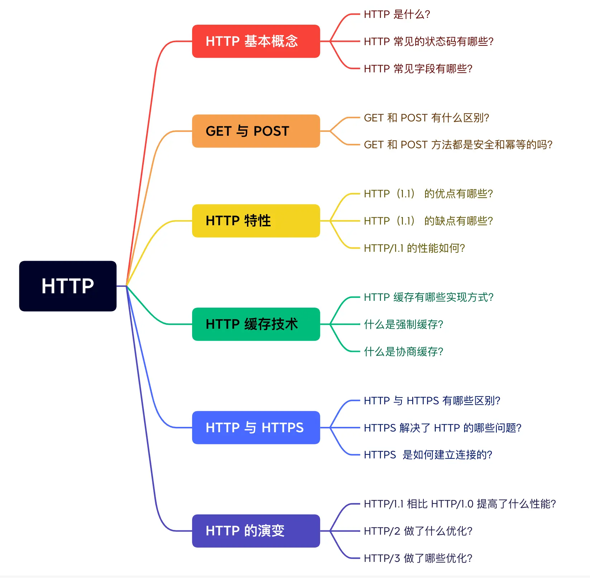

### HTTP
#### HTTP 常见面试题
---

##### 1. HTTP 基本概念
- 超文本传输协议
- 常见状态码
  - 2xx 成功
  - 3xx 重定向
  - 4xx 客户端错误，请求报文有误
  - 5xx 服务器错误
- 常见字段
  - Host字段
  - Content-Length 字段
  - Connectin 字段
  
##### 2. GET与POST
- GET 方法是安全且幂等的，因为它是**只读**操作
- POST 方法是不安全，不幂等的，因为是**新增或提交数据**

##### HTTP 缓存技术
强制缓存和协商缓存技术

##### HTTP 特性
1. 优点：简单，灵活可扩展
2. 缺点：无状态（可解决方案：Cookie技术），明文传输（可解决方案：使用HPPTS，也就是通过引入SSL/TLS层保障信息安全）

#### HTTP与HTTPS
---
1. HTTP是超文本传输协议，信息是明文传输，存在安全风险的问题。HTTPS则解决了HTTP不安全的缺陷，在TCP和HTTP网络层之间加入了SSL/TLS安全协议，使得报文能够加密传输。
2. HTTP连接建立相对简单，TCP三次握手之后便可进行HTTP的报文传输。而HTTPS在TCP三次握手之后，还需要进行SSL/TLS的握手过程，才可进入加密报文传输。
3. 两者的默认端口不一样，HTTP默认端口号是80，HTTPS默认端口号是443.
4. HTTPS协议需要向CA（证书权威机构）申请数字证书，来保证服务器的身份是可信的。

###### TLS协议建立的详细流程
---
1. ClientHello
   由客户端向服务器发起加密通信请求。传输内容包括：TLS协议版本，**客户端随机数**，支持的密码套件：比如RSA加密算法
2. SeverHello
   服务器收到客户端的请求后，向客户端发出响应，也就是SeverHello。服务器回应内容包括：确认TLS版本（如果不支持，则关闭加密通信），**服务器随机数**，确认密码套件，**服务器的数字证书**
3. 客户端回应
   客户端通过操作系统或浏览器的CA公钥，确认服务器的数字证书真实性，然后向服务器发送报文，包括内容：**由服务器公钥加密的随机数**，加密通信算法改变通知，客户端握手结束通知。
4. 服务器最后的回应
   服务器收到客户端的第三个随机数之后，通过协商的加密算法，计算出本次通信的会话密钥，然后向客户端发送最后的消息：加密通信算法改变通知，以后的信息都经过加密处理；服务器握手结束通知

#### HTTP与RPC
---
##### 服务发现
- HTTP通过DNS服务解析出IP地址
- RPC会有专门的中间服务去保存服务名和IP信息，比如Consul或者Etcd，甚至是Redis

##### 底层连接形式
- HTTP默认底层一直保持TCP连接（keep alive）
- RPC也是通过TCP建立连接，并且一般会建一个连接池，有利于提升网络请求性能

##### 传输内容
RPC定制化程度更高，序列化协议的体积更小，性能也会更好一点

#### 服务器如何主动发消息给客户端
- 使用HTTP不断轮询
以扫码登陆为例，不断向后端服务器询问，以大概1到2秒的间隔去不断发出请求
- 长轮询
在一定时间内，只要服务器收到了请求，就立马返回给客户端网页，这样就减少了HTTP的请求次数

像这种服务器将数据推送给浏览器的技术，就是**服务器推送技术**。上面这两种方案本质上，还是客户端主动去取数据。
#### WebSocket
---
##### 应用场景
一个基于TCP的新的应用层协议，可以应用于客户端和服务器之间都要互相主动发大量数据的场景
#### 如何建立WebSocket连接
---
浏览器在利用HTTP协议通信的过程中，如果想要建立WebSocket连接，需要**在HTTP请求中加上特殊的header头**，在一来一回两次握手后WebSocket就建立完成了。

