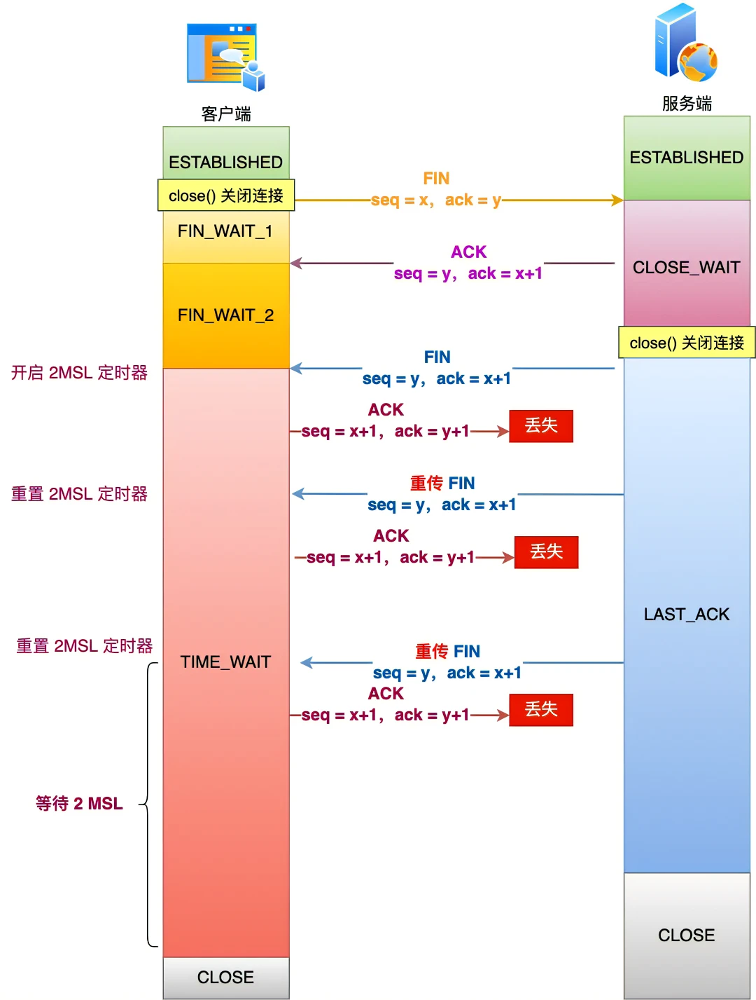
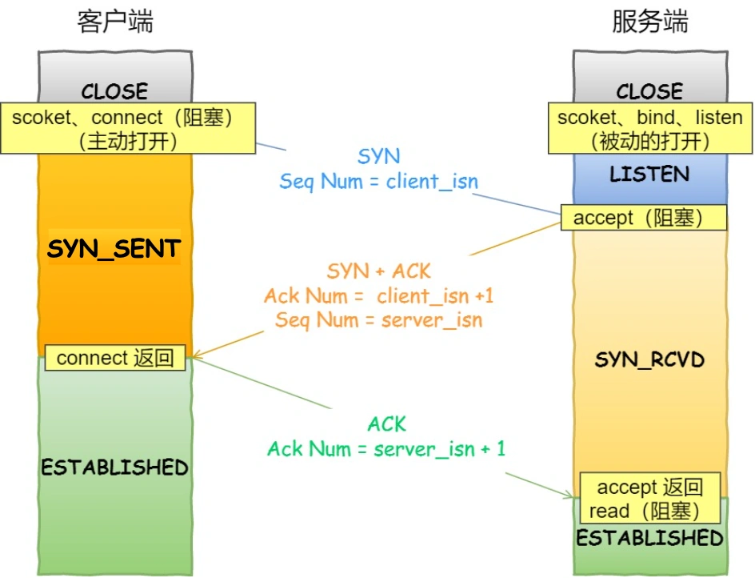
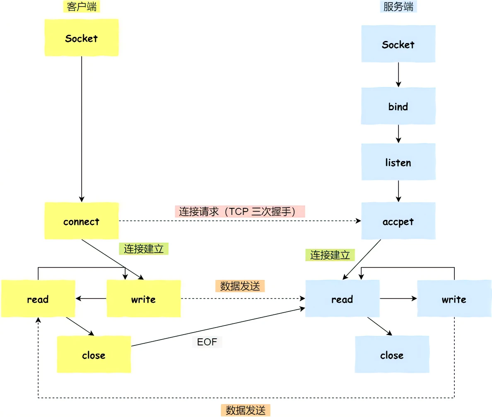
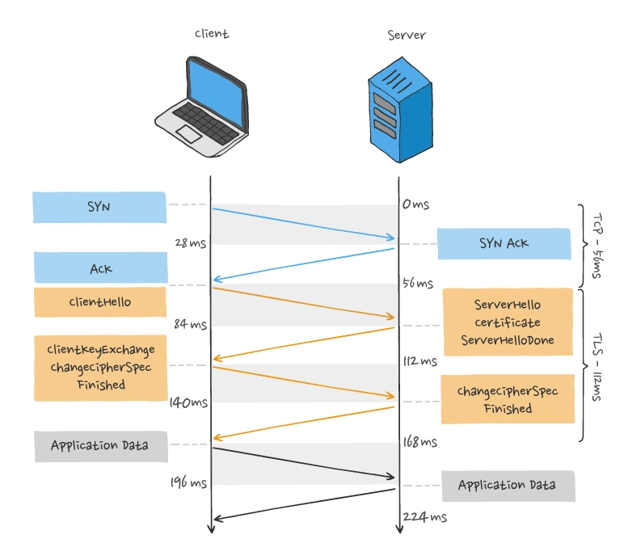

## 三次握手，四次挥手
### TCP基本认识
- TCP是面向连接的、可靠的、基于字节流的传输层通信协议
- 建立TCP连接需要客户端与服务端达成**Socket、序列号和窗口大小**三个信息的共识
- TCP四元组可以唯一确定一个TCP连接，即源目的地址，源目的端口号
- TCP与UDP的区别
    1. 连接
    TCP是面向连接的；UDP是无连接的
    2. 服务对象
    TCP是一对一的两点服务；UDP支持一对一，一对多，多对多的交互通信
    3. 可靠性
    TCP是可靠交付数据的；UDP是尽最大努力交付，不保证可靠交付数据
    4. 拥塞控制、流量控制
    TCP有拥塞控制和流量控制机制，保证数据传输的安全性
    5. 传输方式
    TCP是流式传输，没有边界，但保证顺序和可靠；UDP是一个包一个包的发送，是有边界的，但可能会丢包和乱序

### TCP连接建立
- 三次握手过程
  同步双方的初始序列号，避免重复历史连接的初始化，避免资源浪费
- 既然IP层会分片，为什么TCP层还需要MSS呢？
  IP层不具有重传能力，网络包一旦丢失，就需要TCP重传整个报文。而TCP如果分段的话，只需要TCP重传丢失的那一段报文
- 避免syn攻击？
  利用syn_cookie技术，就算是服务端的半连接队列满了，也可以执行第二次握手

### TCP连接断开

- 第一次挥手丢失
  客户端会触发超时重传机制，重传FIN报文（每次重传的等待时间是上次超时时间的2倍），直到收到服务端的第二次挥手，或者达到最大的重传次数，客户端就会断开连接
- 第二次挥手丢失
  服务端传出的ACK丢失，客户端会触发超时重传机制，重传FIN报文，直到收到服务端的第二次挥手，或者达到最大的重传次数，客户端就会断开连接
- 第三次挥手丢失
  此时客户端已经收到了服务端的ACK报文，处于FIN_WAIT_2状态，等待服务端的FIN报文。此时服务端已经从close_wait状态切换到LAST_ACK状态，等待客户端最后的ACK报文，因此第三次挥手丢失后，服务端会触发超时重传，重传FIN报文，重发控制与客户端一样，达到重传次数上限以后，服务端就会断开连接；客户端处于FIN_WAIT_2的状态是有时长限制的，因此如果一直收不到服务端的FIN报文，客户端在一定时间后也会自动断开连接
- 第四次挥手丢失
  此时服务端处于LAST_ACK状态，第四次挥手报文丢失，服务端就会触发超时重传机制，重传FIN报文，达到重传次数后，服务端自动断开连接；客户端在收到第三次挥手报文时，就会进入TIME_WAIT状态，开启时长为2MSL的定时器，如果中途再次收到第三次挥手报文后，就会重置定时器，当等待2MSL时长后，客户端就会断开连接

### Socket编程

## TCP重传、滑动窗口、流量控制、拥塞控制
- 重传机制
  超时重传 和 快速重传（收到三个相同的ACK则重传）
- 滑动窗口
  发送方的窗口大小由接收方窗口大小决定，但是接收方反馈窗口大小时存在一定时延，因此两者的窗口大小是约等于的。
- 流量控制
  - 操作系统缓冲区与滑动窗口的关系
  应用层不能及时读取数据时，接收方会将窗口大小反馈给发送方，发送方由此减小窗口大小；当服务器端非常繁忙时，操作系统可能会直接减少接收缓冲区的大小，这时如果应用程序无法及时读取缓存数据，就会出现数据包丢失的现象，因此TCP规定不允许同时减少缓存又收缩窗口，而是采用先收缩窗口，过段时间再减少缓存。
  - 窗口关闭
  当TCP连接一方收到对方的零窗口通知后，就**启动持续计时器**，如果持续计时器超时，就会发送**窗口探测报文**，以避免出现互相等待的死锁现象。
- 拥塞控制
  - 慢启动
  当拥塞窗口小于门限阈值时，每接收到一个ACK，拥塞窗口就加一，窗口呈指数形式变大。
  - 拥塞避免
  当拥塞窗口到达门限阈值后，每收到一个ACK，cwnd增加1/cwnd。
  - 拥塞发生
    - 发生超时重传
      ssthresh = cwnd /2 , cwnd = 初始值，进入慢启动
    - 发生快速重传
      cwnd = cwnd /2, ssthresh = cwnd, 进入快速恢复算法
  - 快速恢复
    1. cwnd = ssthresh + 3
    2. 重传丢失的数据包
    3. 如果再收到重复的ACK，那么cwnd++
    4. 如果收到新数据的ACK，把cwnd设置为第1步中的ssthresh，重新进入拥塞避免状态
## 常见问题分析
### 为什么TCP每次建立连接时，初始化序列号都要不一样？
- 为了防止历史报文被下一个相同四元组的连接接收
  当服务器断电重启后，重新建立的相同四元组的连接有可能会导致历史的TCP报文被接收，造成数据错乱
### SYN报文什么情况下会被丢弃
- 半连接队列已经满了
- 全连接队列满了
  服务器并发处理大量请求时，如果TCP accept队列过小，或者应用程序调用accept()不及时，就会造成accept队列满了，这是后续的连接就会被丢弃
### 已建立连接的TCP，收到SYN会发生什么？
1. 客户端的SYN报文里的端口号与历史连接不同
   服务端认为是新的连接要建立，于是通过三次握手来建立新的连接
2. 客户端的SYN报文里的端口号与历史连接相同
   收到的SYN与服务器所等待的序号不一致，服务器会回复一个携带了正确序列号和确认号的ACK报文，接着，客户端收到这个ACK后，发现确认号并不是自己期望收到的，于是就会回RST报文，服务端收到后，就会释放掉该连接
### 四次挥手中收到乱序的FIN包会如何处理？
---
- 在FIN_WAIT_2状态时，如果收到乱序的FIN报文，那么就会被加入到**乱序队列**，并不会进入到TIME_WAIT状态。
- 等再次收到前面被网络延迟的ACK包时，会判断乱序队列有没有数据，然后会检测乱序队列中是否有可用的数据，如果能在乱序队列中找到与当前报文的序列号保持顺序的报文，就会看该报文是否有FIN标志，这时才会进入TIME_WAIT状态
### 在TIME_WAIT状态的TCP连接，收到SYN后会发生什么？
---
1. 合法SYN
   收到的SYN序列号和时间戳都比期望下一个收到的序列号要大。
   这种情况下，就会重用此四元组连接，跳过2MSL而转变为SYN_RECV状态，接着就能进行建立连接过程
2. 非法SYN
   接收方会回复一个第四次挥手的ACK报文，发送方收到后发现并不是自己期望的确认号，就回RST报文给服务端
### TCP连接，一端断电和一端进程崩溃有什么区别？
---
- 一端断电
  如果没有开启keepalive，客户端主机断电，**服务端是感知不到的**，**服务端的TCP连接将会一直处于ESTABLISHED连接状态**，直到服务端重启进程
- 进程崩溃
  TCP的连接信息是由内核维护的，所以当服务端的进程崩溃后，内核需要回收该进程的所有TCP连接资源，**于是内核会发送第一次挥手FIN报文，后续的挥手过程也都是在内核完成**，并不需要进程的参与。

### 拔掉网线后，原本的TCP连接还存在吗
---
客户端拔掉网线后，并不会直接影响TCP连接状态。拔掉网线后，TCP连接是否还会存在，关键要看拔掉网线后，有没有进行数据传输，以及有没有开启keepalive机制

### tcp_tw_reuse为什么默认是关闭的
---
tcp_tw_reuse的作用是让客户端快速复用处于TIME_WAIT状态的端口，相当于跳过了TIME_WAIT状态，这可能会出现以下两个问题
1. 历史RST报文可能会终止后面相同四元组的连接，因为RST的时间戳就算是过期的，也不会丢弃
2. 如果第四次挥手的ACK报文丢失了，有可能被动关闭连接的一方不能被正常的关闭，而是因后续接收到的RST报文关闭

### HTTPS中TLS和TCP能同时握手吗？
---
- HTTPS是先进行TCP三次握手，再进行TLSv1.2四次握手
- HTTPS中的TLS握手过程可以同时进行三次握手必须满足条件：
  - 客户端和服务端都开启了TCP Fast Open功能，且TLS版本是1.3
  - 客户端和服务端已经完成过一次通信

### TCP Keepalive 和 HTTP Keep-Alive是一个东西吗
- HTTP 的 Keep-Alive，是由应用层（用户态）实现的，称为HTTP长连接
- TCP的Keepalive，是由TCP层（内核态）实现的，称为TCP保活机制

### TCP协议有什么缺陷
---
1. TCP建立连接的延迟
   

2. TCP存在队头阻塞问题
   TCP层必须保证收到的字节数据是完整且有序的，序列号较低的TCP段在网络传输中丢失了，即使序列号较高的TCP段已经被接收了，应用层也无法从内核中读取到这部分数据。
3. 网络迁移需要重新建立TCP连接
   当移动设备的网络从4G切换到WIFI时，意味着IP地址变化了，那么必须重新建立TCP连接。

### 关于端口的使用问题
---
#### TCP和UDP可以同时绑定相同的端口吗？
传输层中端口的作用，是为了区分同一个主机上不同应用程序的数据包，两个传输层协议UDP和TCP在内核中是两个完全独立的软件模块。根据协议字段确定由处理的协议程序，交给不同的上层应用程序。

#### 多个TCP服务进程可以绑定同一个端口吗？
如果两个TCP服务进程同时绑定的IP地址和端口都相同，那么执行bind()时候就会出错，错误是"Address already in use"
- 重启服务进程时，为什么会有"Address already in use"的报错信息？
  因为在关闭TCP连接时，主动关闭方会在**TIME_WAIT这个状态里停留一段时间**，这个时间大约为2MSL；如果在调用bind()时，对socket设置SO_REUSEADDR属性，可以解决这个问题

#### 客户端的端口可以重复使用吗？
TCP连接由四元组确定，只要四元组中的其中一个不同，就可以表示不同的TCP连接

### 服务端没有Listen，客户端发起连接建立，会发生什么？
服务端如果只bind了IP地址和端口，而没有调用Listen的话，然后客户端对服务端发起了连接建立，服务端会回RST报文。
- 没有listen，能建立TCP连接吗？
  - 是可以的，客户端是可以自己连自己形成连接（TCP自连接），也可以两个客户端同时向对方发出请求建立连接（TCP同时打开），这两个情况都有一个共同点，就是没有服务端参与，也就是没有listen，就能建立连接。
  - 在TCP自连接的情况中，客户端在connect方法时，最后会将自己的连接信息放入到全局hash表中，然后将信息发出，消息在经过回环地址重新回到TCP传输层的时候，就会根据 IP +端口信息，再一次从这个全局hash中取出信息。于是握手包一来一回，最后成功建立连接。

### 没有accept，能建立TCP连接吗？
---
1. 每一个socket执行listen时，内核都会自动创建一个半连接队列和全连接队列。
2. 每第三次握手时，TCP连接会放在半连接队列中，直到第三次握手到来，才会被放到全连接队列中。
3. accept只是为了从全连接队列中拿出一条连接，本身跟三次握手几乎**毫无关系**。
4. 出于效率考虑，虽然都叫队列，但**半连接队列**其实被设计成了**哈希表**，而全连接队列本质是链表。
5. 全连接队列满了，再来第三次握手也会丢弃，此时如果`tcp_abort_on_overflow=1`，还会直接发RST给客户端。
6. 半连接队列满了，可能是因为受到了`SYN Flood`攻击，可以设置`tcp_syncookies`，绕开半连接队列。
7. 客户端没有半连接队列和全连接队列，但有一个**全局hash**，可以通过它实现自连接或TCP同时打开。

### TCP四次挥手，可以变成三次挥手吗？
--- 
当被动关闭方在TCP挥手过程中，如果没有数据要发送，同时使用了TCP延迟确认机制，那么第二和第三次挥手的ACK和FIN报文就会合并传输，这样就变成了三次挥手。