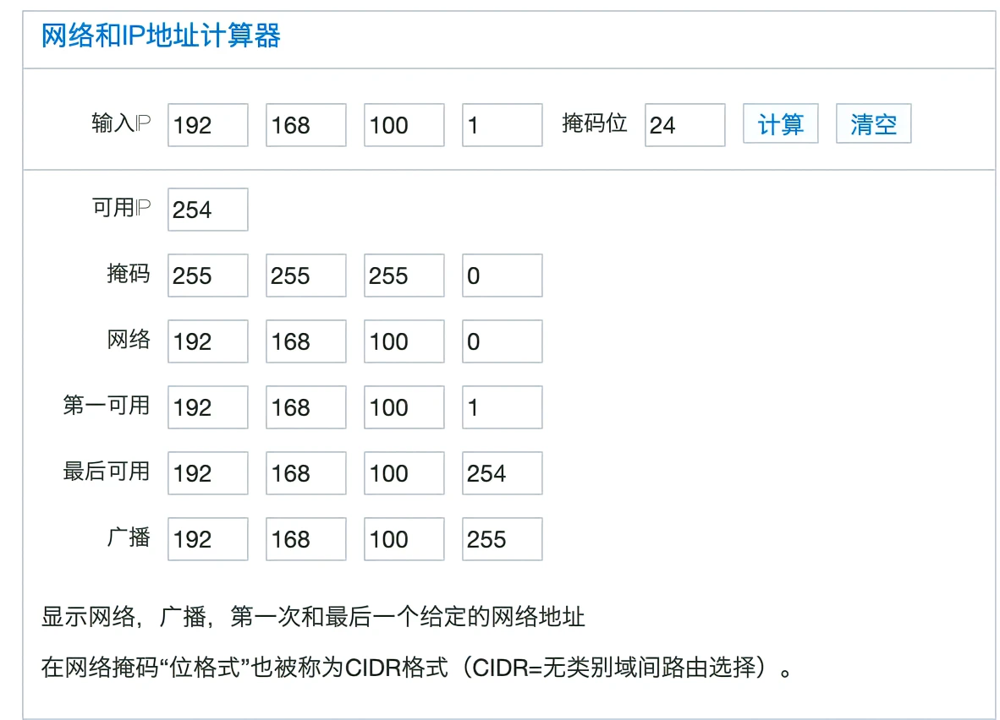
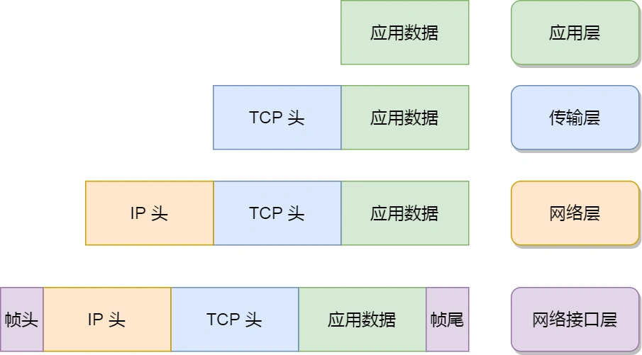
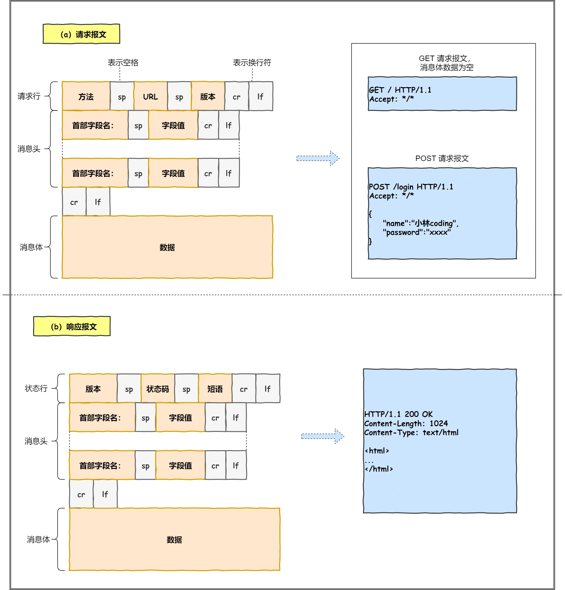
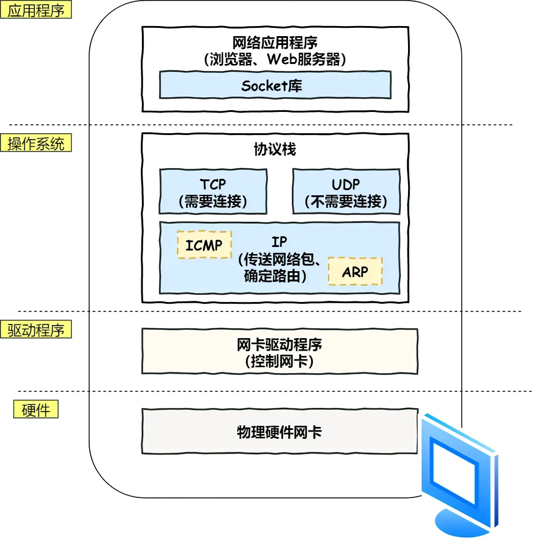
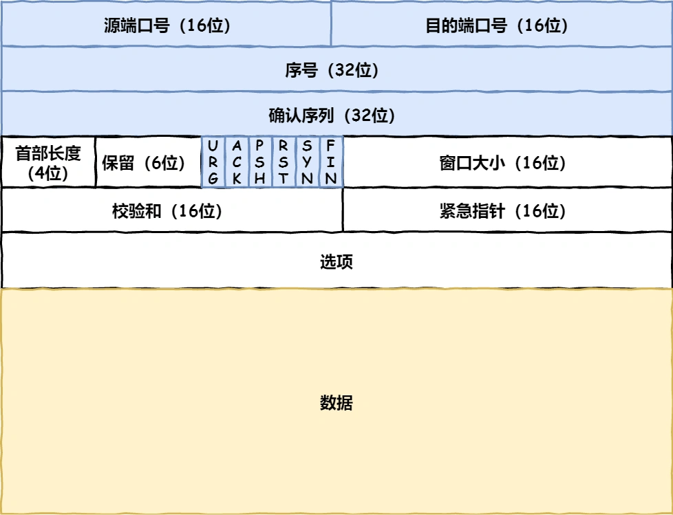
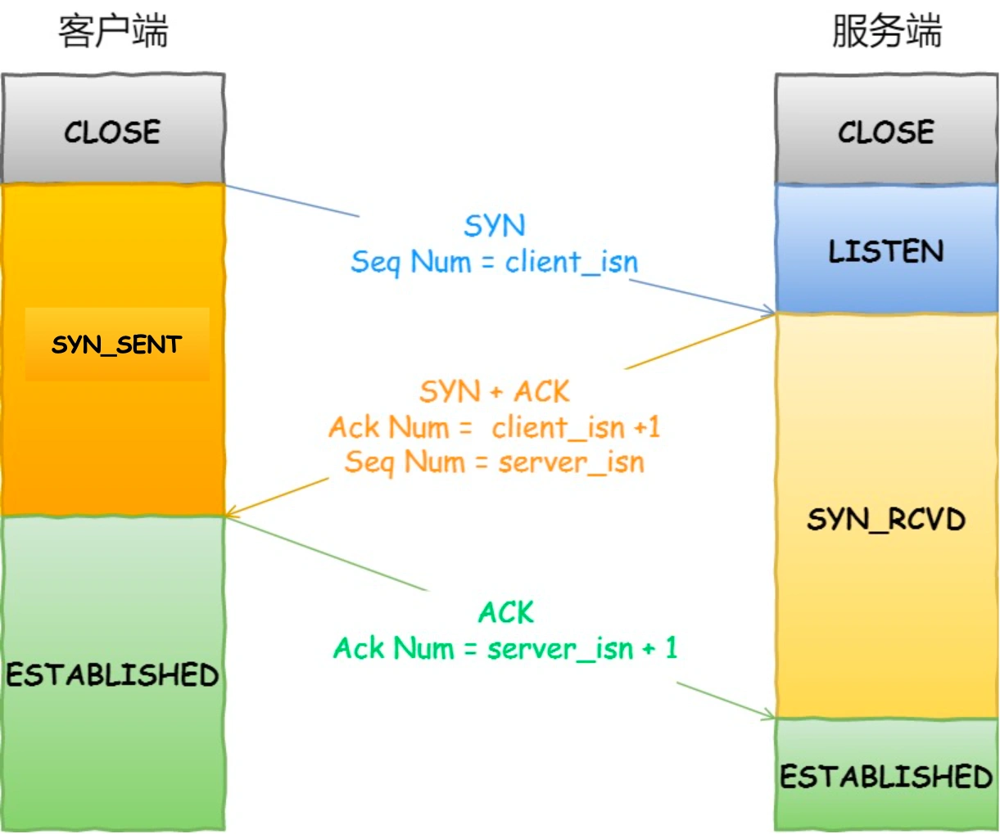

### TCP/IP模型
- 问：为什么要有TCP/IP模型
  - 同一设备上的进程间通信方式：管道、消息队列、共享内存、信号等
  - 不同设备上的进程间通信方式：制定一套通用的网络协议
- **应用层**：专注于为用户提供应用功能，比如HTTP、DNS、SMTP
  - 应用层工作在操作系统中的用户态，传输层及以下则工作在内核态
- **传输层**：TCP与UDP
  - TCP：流量控制、超时重传、拥塞控制等
  - UDP：不保证数据包是否能抵达对方，但实时性相对更好，传输效率也高
  - 传输层的数据包大小如果超过MSS（TCP最大报文段长度），就会将数据包分块，每个分块称为TCP段
  - 当传输层将数据包传给应用时，需要指定的编号来**区分不用的应用**，**这个编号就是端口号**。eg. 80端口通常是Web服务器所用，22端口远程登录服务器用，对于浏览器中的每个标签都会由操作系统为这些进程分配临时的端口号
- **网络层**：实际的传输功能
  - IP协议：将传输层的报文作为数据部分，加上IP报头组装成IP报文，超出MTU大小就会再次进行分片
  - IP地址包含两部分的意义：网络号和主机号，网络号需要与子网掩码按位与得到
  - 

  - 根据网络号寻找目标子网
- **链路层**：硬件和软件的结合体，该层是协议栈中软件和硬件交接的地方
  - 在IP头部的前面加上MAC头部，封装成数据帧发送到网络上
  - 

### 键入网址到网页显示全过程
#### HTTP
- 第一步，解析URL
- 第二步，生成HTTP请求信息

#### 真实地址查询--DNS
实现由服务器域名到IP地址的转换过程
- 流程：客户端发出一个DNS请求，**将请求发送到本地DNS服务器，本地服务器先查询本地缓存，如果没有，就询问根域名服务器**，由根域名服务器指路下层服务器，直到解析出IP地址。
- 注意：DNS查询本身是一个黑盒子，提供域名转换服务，其实内部也是非常复杂的查询系统。所有DNS请求和回答报文使用**UDP数据报经端口53发送**
#### 指南好帮手-协议栈

#### 可靠传输--TCP
TCP报文头部格式：

- 状态位：SYN是发起一个连接，ACK是回复，RST是重新连接，FIN是结束连接。**TCP是面向连接的**，双方要维护连接的状态，这些带状态的包会引起双方的状态变更
- 三次握手建立TCP连接：保证双方都有发送和接收的能力

- TCP 分割数据并生成TCP报文，其中两个端口号，一个是浏览器监听的端口（通常是随机生成的），一个是Web服务器监听的端口（HTTP默认端口号是80，HTTPS默认端口号是443）

#### 远程定位--IP
- 当客户端有多个网卡时，就会有多个IP地址，此时源地址应该根据路由表选择一个指定网卡发送包
#### 两点传输--MAC
- 先查询 ARP 缓存，如果其中已经保存了对方的 MAC 地址，就不需要发送 ARP 查询，直接使用 ARP 缓存中的地址。
- 而当 ARP 缓存中不存在对方 MAC 地址时，则发送 ARP 广播查询
#### 出口--网卡
网卡将数字信息转换为电信号
#### 送别者--交换机
**工作在MAC层**
交换机在内部的映射表查询MAC地址和网线端口的映射关系，如果未查询到就会利用广播地址转发到所有端口
#### 出境大门--路由器
**工作在网络层**
寻址和转发（具有IP地址和MAC地址）

