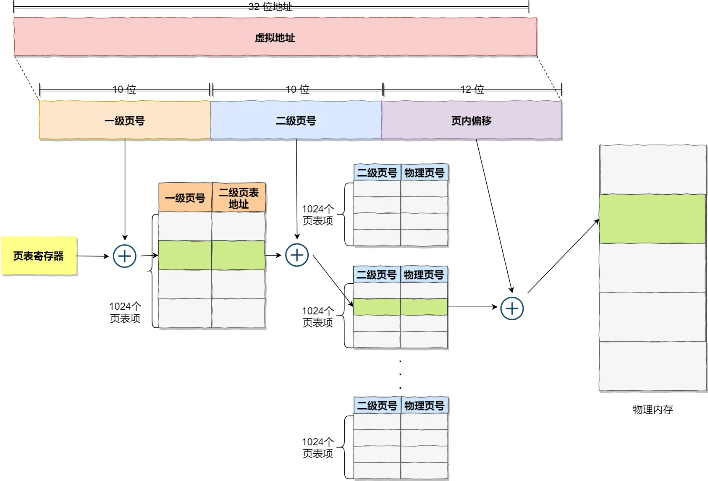
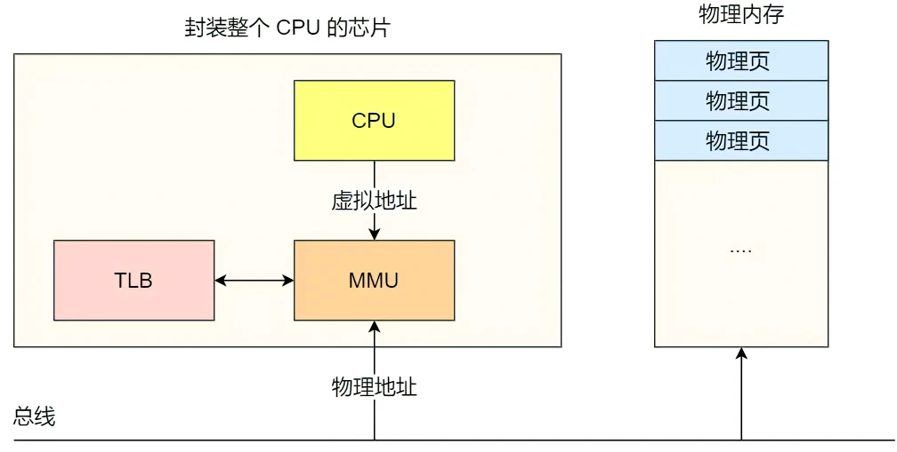

## 内存管理

### 为什么要有虚拟内存？
1. 虚拟内存
   操作系统为每个进程分配独立的一套**虚拟地址**，操作系统会将**虚拟地址映射到真实的物理地址**，各个进程之间的内存互不干扰
2. 内存分段
   - 程序由若干个逻辑分段组成，如可由代码分段、数据分段、栈段、堆段组成。用**分段的形式**将这些段分离出来
   - 分段机制下的虚拟地址由两部分组成，**段选择因子**和**段内偏移量**
   - 存在的问题
     - 内存碎片：多个段之间存在的内存小片段
       可以使用内存交换解决内存碎片问题，但是内存交换的时候需要涉及到硬盘访问，效率很低
3. 内存分页
   **将整个虚拟和物理内存空间切成一段段固定尺寸的大小**，这样的一个内存空间称为**页**
   如果只使用简单的分页，在32位环境下，虚拟地址空间共有4GB，假设一个页的大小是4KB，那么就需要2^20个页，每个页表项需要4个字节大小来存储，那么就需要4MB的内存来存储页表。每个进程都用自己的虚拟空间，即拥有自己的页表，资源消耗就太大了。
   - 多级页表
     将页表分为1024个页表，每个页表中包含1024个页表项，形成二级分页。
     **如果某一个一级页表的页表项没有被用到，也就不需要创建这个页表项对应的二级页表了，即可以在需要时才创建二级页表**

    

   - TLB
     多级页表在虚拟地址到物理地址的转换中多了几道转换的工序，带来了一定时间上的开销。
     - 利用程序的局部性原理，在CPU芯片中，加入一个专门存放程序最常访问的页表项的Cache，这个Cache就是TLB，通常称为页表缓存、转址旁路缓存、快表等。CPU芯片中的MMU负责地址转换和TLB的访问与交互。
     
     

4. 段页式内存管理
   内存分段和内存分页可以组合起来使用，称为段页式内存管理。
   - 先将程序划分为多个有逻辑意义的段；
   - 接着再把每个段划分为多个页，也就是对分段划分出来的连续空间，再划分固定大小的页；
   地址结构由**段号、段内页号和页内偏移**三部分组成。

### malloc是如何分配内存的？
1. malloc是如何分配内存的？
   - 方式一：通过brk()系统调用从堆分配内存；（一般小文件用此方式）
   - 方式二：通过mmap()系统调用在文件映射区域分配内存；
2. malloc分配的是虚拟内存
   如果分配后的虚拟内存没有被访问的话，虚拟内存是不会映射到物理内存的，这样就不会占用物理内存。只有在访问已分配的虚拟地址空间时，操作系统通过查找页表，发现虚拟内存对应的页没有在物理内存中，就会触发缺页中断，然后操作系统会建立虚拟内存和物理内存之间的映射关系。
3. malloc(1)会分配多大的虚拟内存？
   malloc在分配内存时，会先遍历内存池中的空闲内存，如果有合适的就分配，如果没有合适的，就向操作系统申请，而向操作系统申请的时候，并不是老老实实按照用户预期申请的字节数来分配内存空间大小，而是**会预分配更大的空间作为内存池**。
4. free()释放空间，会归还给操作系统吗？
   - malloc 通过 brk() 方式申请的内存，free 释放内存的时候，**并不会把内存归还给操作系统，而是缓存在 malloc 的内存池中，待下次使用**；
   - malloc 通过 mmap() 方式申请的内存， free 释放内存的时候，**会把内存归还给操作系统，内存得到真正的释放**。
5. 为什么不全部使用 mmap 来分配内存？
向操作系统申请内存，是要通过系统调用的，执行系统调用是要进入内核态的，然后在回到用户态，运行态的切换会耗费不少时间。另外因为 mmap 分配的内存每次释放的时候，都会归还给操作系统，于是每次 mmap 分配的虚拟地址都是缺页状态，然后在第一次访问该虚拟地址的时候，就会触发缺页中断。
   - 频繁通过mmap分配内存的话，不仅每次都会发生运行态的切换，还会发生缺页中断（在第一次访问虚拟地址后），这样会导致CPU消耗较大。
   - 为了改进这两个问题，malloc 通过 brk() 系统调用在堆空间申请内存的时候，由于堆空间是连续的，所以直接预分配更大的内存来作为内存池，当内存释放的时候，就缓存在内存池中。
6. 能全部使用 brk 来分配？
   由于 brk() 不会直接把内存归还给操作系统，容易产生越来越多的不可用小片段内存碎片，导致“内存泄漏”
7. free() 函数只传入一个内存地址，为什么能知道要释放多大的内存？
   malloc返回给用户态的内存起始地址比进程的堆空间起始地址多了16字节，这多出来的16字节就是保存了该内存块的描述消息，比如有该内存块的大小。

### 内存的分配和管理问题
1. 虚拟内存有什么作用？
   - 第一，**虚拟内存可以使得进程的运行内存超过物理内存大小**，因为程序运行符合局部性原理，对于没有被经常使用到的内存，可以把它换出到物理内存之外，比如硬盘上的swap区域。
   - 第二，**解决了多进程之间地址访问冲突的问题**。每个进程都有自己的页表，所以每个进程的虚拟内存空间就是相互独立的。
   - 第三，**提供了更好的安全性**。页表里的页表项还有一些标记属性的比特，比如控制一个页的读写权限，标记该页是否存在等。
2. 内存分配的过程
   - 当应用程序读写一块虚拟内存时，CPU就会去访问这个虚拟内存，这是如果发现**这个虚拟内存没有映射到物理内存**，CPU就会产生**缺页中断**，进程会从用户态切换到内核态，并将缺页中断交给内核的 Page Fault Handle (缺页中断函数) 处理；
   - 缺页中断函数判断是否有空闲的物理内存？直接分配内存 ： **后台内存回收**；
   - 后台内存回收速度足够？ 分配内存 ： **直接内存回收**；
   - 直接内存回收速度足够？ 分配内存 ： **触发 OOM 机制**；
   - **后台内存回收**：在物理内存紧张的时候，会唤醒kswapd内核线程来回收内存，这个回收内存的过程是**异步**的，不会阻塞进程的执行；
   - **直接内存回收**：直接回收内存，这个回收的过程是**同步**的；
   - OOM (Out of Memory)机制：根据算法选择一个占用物理内存较高的进程，然后将其杀死，以便释放内存资源，如果物理内存仍然不足，会继续杀死占用物理内存较高的进程，直到释放足够的内存位置。
3. 哪些内存可以被回收？
   - **文件页**：内核缓存的磁盘数据（Buffe）和内核缓存的文件数据（Cache）都叫作文件页。**回收干净页的方式是直接释放内存，回收脏页的方式是先写回磁盘后再释放内存**；
   - **匿名页**：这部分内存没有实际载体，不像文件缓存有硬盘文件这样一个载体，比如堆、栈数据等。它们可能再次被访问，**回收的方式是通过 Linux 的 Swap 机制，Swap 会把不常访问的内存先写到磁盘，然后再释放；
   - 回收的算法都是LRU算法，该算法维护着 active 和 inactive 两个双向链表。
4. 回收内存带来的性能影响
   - 调整文件页和匿名页的回收倾向
   文件页的回收操作对系统的影响会少一点，因为对干净页的回收是不会发生磁盘I/O的。
   - 尽早触发 kswaped 内核线程异步回收内存
   可以通过调整内核设定的三个内存阈值：页最小阈值，页低阈值，页高阈值。让异步回收触发时间提前，可以避免应用程序阻塞。
5. 如何保护一个进程不被 OOM 杀掉呢？
   Linux 是根据 oom_badness()函数对进程打分，分数越高越有可能被首先杀掉，可以通过调整oom_score_adj来避免重要的进程被杀掉

### 在 4GB 物理内存的机器上，申请 8GB 内存会怎么样/
- 在 32 位操作系统上，因为进程理论上最大能申请 3GB 大小的虚拟内存，所以直接申请 8GB 内存，会申请失败。
- 在 64 位操作系统上，因为进程理论上最大能申请 128TB 大小的虚拟内存，即使物理内存只有 4GB，申请 8GB 的内存也是没问题的，因为申请的内存是虚拟内存。如果这块虚拟内存被访问了，要看系统有没有 Swap 分区：
  - 如果没有 Swap 分区，因为物理空间不够，进程会被操作系统杀掉，原因是 OOM。
  - 如果有 Swap 分区，即使物理内存只有 4GB，程序也能正常使用 8GB 的内存，进程可以正常运行。

### 如何避免预读失败和缓存污染问题？
#### Linux 和 MySQL 的缓存
1. Linux 操作系统的缓存
   在应用程序读取文件的数据时，Linux 操作系统会对读取的文件数据进行缓存，缓存在文件系统中的 **Page Cache (页缓存)**。页缓存属于内存空间的数据。
2. MySQL 的缓存
   MySQL 的数据是存储在磁盘里的，为了提升数据库的读写性能，Innodb 存储引擎设计了一个**缓冲池**(Buffer Pool)， Buffer Pool 属于内存空间里的数据。

#### 预读失效怎么办？
- 预读机制
  Linux 操作系统为基于 Page Cache 的读缓存机制提供**预读机制**，利用空间局部性原理，从磁盘上读取数据时，会将多读取几个临近的 Page装入 Page Cache中。由此**减少了磁盘 I/O 次数，提高系统磁盘 I/O 吞吐量**。
- 预读失效会带来什么问题？
  - 如果**这些提前被加载进来的页，并没有被访问**，相当于这个预读工作是白做了，这个就是**预读失效**。
  - 如果这些预读页如果一直不会被访问到，就会出现一个奇怪的问题，**不会被访问的预读页却占用了LRU链表前排的位置，而末尾淘汰的页，可能是热点数据，这样就大大降低了缓存命中率**。
- 如何避免预读失效造成的影响
  不能简单地将预读机制去掉，因为大部分情况下，空间局部性原理还是成立的。
  &ensp;
  要避免预读失效带来影响，最好就是**让预读页停留在内存里的时间要尽可能的短，让真正被访问的页才移动到LRU链表的头部，从而保证真正被读取的热数据留在内存里的时间尽可能长**。
  - Linux 操作系统实现了两个 LRU 链表：**活跃 LRU 链表**和**非活跃 LRU 链表**。**预读页只需要加入到 inactive list区域的头部，当页被真正访问的时候，才将页插入 active list 的头部**。
  - MySQL 的 Innodb 存储引擎是在一个 LRU 链表上划分出两个区域， **young区域和 old 区域**。young 区域在 LRU 链表的前半部分，old 区域则在后半部分，这两个区域拥有各自的头尾结点。默认比例是 63:37。**划分这两个区域后，预读的页就只需要加入到 old 区域的头部，当页被真正访问的时候，才将页插入 young 区域的头部**。

#### 缓存污染，怎么办？
问题：当我们在批量读取数据的时候，由于数据被访问了一次，这些大量数据都会被加入到活跃 LRU 链表里，然后之前缓存在活跃 LRU 链表里的热点数据全部都会被淘汰，**如果这些大量的数据在很长一段时间都不会被访问的话，那么整个活跃 LRU 链表就被污染了**。
- 缓存污染会带来什么问题？
  如果一个 SQL 语句**扫描了大量的数据**，在 Buffer Pool 空间比较有限的情况下，可能会将 **Buffer Pool 里的所有页都替换出去，导致大量热数据被淘汰**。
- 怎么避免缓存污染造成的影响？
  前面提到的 LRU 算法加入活跃链表的门槛太低了，导致原来的热数据容易被淘汰。**只要我们提高进入到活跃 LRU 链表的门槛，就能有效地保证活跃 LRU 链表里的热数据不会被轻易替换掉**。
  - Linux 操作系统：在内存页被访问**第二次**的时候，才将页从 inactive list升级到 active list里。
  - MySQL Innodb：在内存页被访问**第二次**的时候，并不会马上将该页从 old 区域升级到 young 区域，还要进行**停留在 old 区域的时间判断**：
    - 如果第二次访问时间与第一次访问的时间**在 1 秒内**(默认值)，那么该页就**不会**被从 old 区域升级到 Young 区域；
    - 如果第二次的访问时间与第一次访问的时间**超过 1 秒**，那么该页就**会**从 old 区域升级到 young 区域；

### 深入理解 Linux 虚拟内存管理

### 深入理解 Linux 物理内存管理