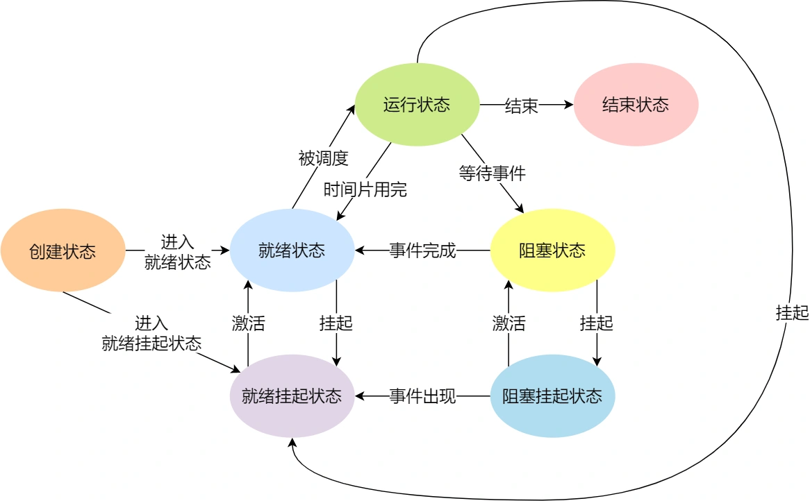

## 进程、线程基础知识
### 进程
1. 进程的状态
   - 运行状态：该时刻进程占用CPU；
   - 就绪状态：可运行，由于其他进程处于运行状态而暂时停止运行；
   - 阻塞状态：该进程正在等待某一事件发生（如等待输入/输出操作的完成）而暂时停止运行，这时，即使给它CPU控制权，它也无法运行；
    &ensp;
    如果有大量处于阻塞状态的进程，进程可能会占用着物理内存空间，因此通常会把阻塞状态的进程的物理内存空间换出到硬盘，等需要再次运行时，再从硬盘换入到物理内存。那么就需要一个新的状态，来**描述进程没有占用实际的物理空间的情况，这个状态就是挂起状态**。
    &ensp;
    挂起状态可以分为两种：
     - 阻塞挂起状态：进程在外存并等待某个事件的出现；
     - 就绪挂起状态：进程在外存，但只要进入内存，就可以被CPU执行
    

2. 进程的控制结构
在操作系统中，是用**进程控制块**(process control block, PCB) 数据结构来描述进程.
- PCB 是进程存在的唯一标识；
- 进程描述信息：
  - 进程标识符：标识各个进程；
  - 用户标识符：进程归属的用户，用户标识符主要为共享和保护服务；
- 进程控制和管理信息：
  - 进程当前状态，如 new, ready, running, waiting 或 blocked 等；
  - 进程优先级：进程抢占 CPU 时的优先级；
- 资源分配清单：
  - 有关内存地址空间或虚拟地址空间的信息，所打开文件的列表和所使用的 I/O 设备信息。
- CPU 相关信息：
  - CPU 中各个寄存器的值，当进程被切换时，CPU 的状态信息都会被保存在相应的 PCB 中，以便进程重新执行时，能从断点处继续执行。

3. 进程的控制
- 创建进程
  创建 PCB；
  为该进程分配运行时所必需的资源；
  将 PCB 插入到就绪队列，等待被调度；
- 终止进程
  查找需要被终止的进程的 PCB；
  如果处于执行状态，则立即终止，然后将 CPU 资源分配给其他进程；
  **如果其还有子进程，则应将子进程交给 1 号进程接管**；
  将该进程所拥有的全部资源归还给操作系统；将其从 PCB 所在队列中删除；
- 阻塞进程
  找到将被阻塞的进程的 PCB；
  如果该进程为运行状态，则**保护现场**，将其状态转为阻塞状态，停止运行；
  将该 PCB 插入到阻塞队列中；
- 唤醒进程
  在**该事件的阻塞队列**中找到相应进程的 PCB；
  将其从阻塞队列中移除，并置其状态为就绪状态；
  把该 PCB 插入到就绪队列中，等待调度程序调度；

4. 进程的上下文切换
从一个进程切换到另一个进程运行，称为进程的上下文切换。**进程的上下文切换不仅包含了虚拟内存、栈、全局变量等用户空间的资源，还包括了内核堆栈、寄存器等内核空间的资源。**

### 线程
1. 为什么使用线程？
   有一些场景下，需要多个进程之间并发运行，但是多进程的方式存在着问题：(1) 进程之间如何如何通信，共享数据？(2) 维护进程的系统开销较大。
   因此需要一种新的实体，满足以下特性：
   - 实体之间可以并发运行；
   - 实体之间可以共享相同的地址空间；
   这个新的实体就是**线程 (Thread)**，线程之间可以并发运行且共享相同的地址空间。
2. 什么是线程？
   **线程是进程当中的一条执行流程。**
   同一个进程内多个线程之间可以**共享代码段、数据段、打开的文件等资源**，**但每个线程各自都有一套独立的寄存器和栈**，这样可以确保线程的控制流是相对独立的。
   优点：
   - 一个进程中可以同时存在多个线程；
   - 各个线程之间可以并发执行；
   - 各个线程之间可以共享地址空间和文件资源；
   缺点：
   - 当进程中的一个线程崩溃时，会导致其所属进程的所有线程崩溃。
3. 线程与进程的比较
   - **进程是资源（包括内存、打开的文件等）分配的单位**，**线程是CPU调度的单位**；
   - 进程拥有完整的资源平台，而线程只独享必不可少的资源，如寄存器和栈；
   - 线程同样具有就绪、阻塞、执行三种基本状态，同样具有状态之间的转移关系；
   - 线程能减少并发执行的时间和空间开销；
4. 线程的上下文切换
   - 当两个线程不是属于同一个进程时，则切换的过程就跟进程上下文一样；
   - **当两个线程是属于同一个进程，因为虚拟内存是共享的，所以在切换时，虚拟内存这些资源就保持不动，只需要切换线程的私有数据、寄存器等不共享的数据；**
5. 线程的实现
   - 用户线程 (User Thread)：在用户空间实现的线程，不是由内核管理的线程，是由用户态的线程库来实现线程的管理；
   &ensp;
   **用户线程的整个线程管理和调度，操作系统是不直接参与的，而是由用户级线程库函数来完成线程的管理，包括线程的创建、终止、同步和调度等。**
   &ensp;
   - 内核线程 (Kernel Thread)：在内核中实现的线程，是由内核管理的线程；
   &ensp;
   
   &ensp;
   - 轻量级进程 (LightWeight Process)：在内核中来支持用户线程；
  
